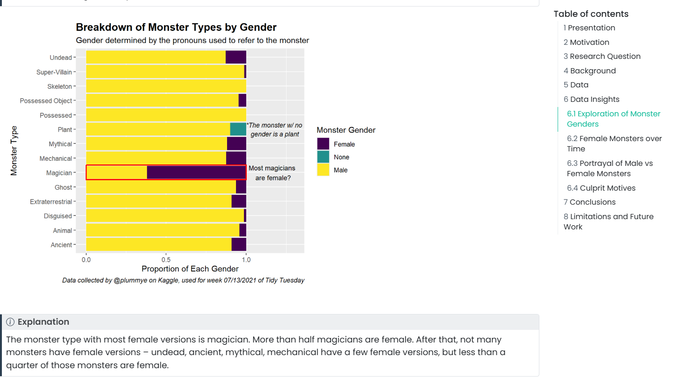
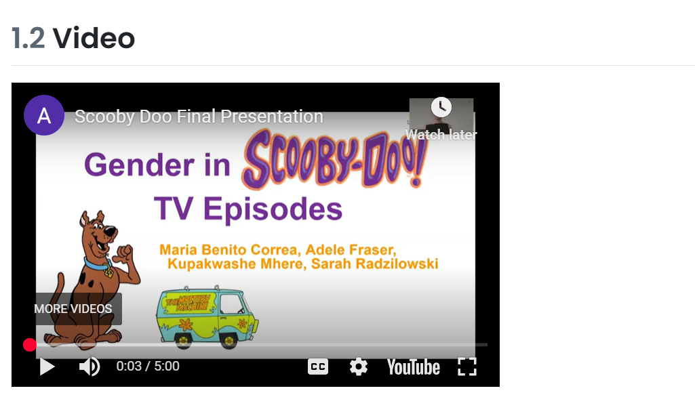

## Gender in Scooby Doo TV Episodes

## What is this GitHub repository all about?
This GitHub repository is for Project Mystery Inc’s group project: Gender in Scooby Doo TV Series. It includes summaries of effective teamwork readings, exploratory data analysis, and a final report. The final report answers the main research questions, Does the gender of a character in Scooby Doo episodes influence their likelihood of being portrayed as a monster or criminal? and Are females or males unfairly represented across Scooby Doo episodes? Using a variety of graphs and written analysis. The repository also contains a YouTube video with the recorded presentation of our report, as well as the slides used in the presentation. 

## What software (with the version numbers) needs to be installed to run the code contained in this GitHub repository?
The softwares that needs to be installed to run this code are R version 4.4.3+ and RStudio 2024.12.1 Build 563 and above. Install the following packages in RStudio to be able to run the code: gt, patchwork, janitor, ggthemes, tidytuesday, Dataexplorer, and tidyverse.

## What steps need to be taken to run the code contained in this GitHub repository? Think about the steps you did at the beginning of the semester to prepare your machine for class.
Data renderable locally through RStudio render option. Before rendering, one will need to install RStudio and R for their machine (Mac or Windows), and set up Github to be able to pull code from the project repository located on Github. The published website content is also available for view through URL: https://mac-stat112-s25.github.io/project-mystery-inc-ii/

## What does the expected output look like? You can use one or more screenshots of the main features.
The expected output is graphs which should show Less monsters and culprits who are female, the user should expect to see mainly colored graphs from the embedded video, an example is attached below : 

On the right side of the website, there is an interactive table of contents. The viewer can select between sections and the page will take them to that section of the report. 

There should also be a Youtube video and Google Slide presentation embedded in the report. Here is what the video should look like.

